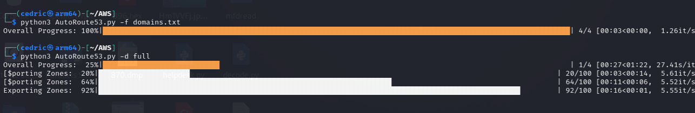

# Autoroute53
Route53 DNS Zone export in CSV


# AWS Route53 DNS Record Exporter Script

## Objective

The purpose of this script is to automate the process of exporting DNS records from AWS Route53. It is designed to handle different scenarios:

1. **Export DNS Records for Specific Domains**: If provided with a text file containing a list of domain names, the script will export the DNS records for those specific domains.
2. **Export DNS Records for a Single Domain**: The script can target a single domain if the domain name is provided as a command-line argument.
3. **Export All DNS Records**: If instructed, the script can export DNS records for all the domains managed by AWS Route53.

Additionally, the script features a progress bar for visual feedback during the export process.

## How It Works

The script uses `boto3`, the AWS SDK for Python, to interact with AWS Route53. It retrieves the list of hosted zones and their corresponding DNS records, exporting them to CSV files. The script supports command-line arguments to specify the operation mode:

- `-f domains.txt`: Reads a list of domains from a provided text file and exports their DNS records.
- `-d domain.com`: Exports DNS records for the specified domain.
- `-d full`: Exports DNS records for all domains in the AWS Route53 account.

Progress is displayed via a dynamic progress bar, implemented using the `tqdm` library.


## Requirements

To run the script, you need:

1. Python 3.x, `boto3` library, `tqdm` library, AWS CLI
5. AWS credentials configured (Generate a AWS KEY in your AWS :Security Settings account)

### `requirements.txt`
```
pip install -r requirements.txt
```
#### Install AWS CLI

The AWS Command Line Interface (CLI) is required to configure your AWS credentials. Install it following the instructions on the [AWS CLI User Guide](https://docs.aws.amazon.com/cli/latest/userguide/cli-chap-install.html).

#### Configure AWS CLI

Run the following command and follow the prompts to input your AWS credentials:
```
aws configure
```


### Execution
```
python AutoRoute53.py -f domains.txt  # Exports DNS records for domains listed in domains.txt
python AutoRoute53.py -d example.com  # Exports DNS records for example.com
python AutoRoute53.py -d full         # Exports DNS records for all domains
```

